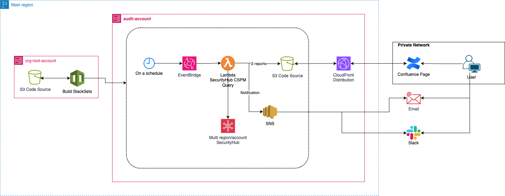

# AWS Security Reporting Suite

[](LICENSE)
[](https://aws.amazon.com/)
[](https://aws.amazon.com/cloudformation/)

An automated serverless suite to generate and publish AWS security findings and infrastructure inventory reports for secure stakeholder collaboration in human-readable formats.

## Table of contents
- [AWS Security Reporting Suite](#aws-security-reporting-suite)
  - [Table of contents](#table-of-contents)
  - [📖 Introduction](#-introduction)
  - [🛠 What it does](#-what-it-does)
  - [📐 Design](#-design)
    - [Assumptions](#assumptions)
    - [SecurityHub CSPM Reports Architecture](#securityhub-cspm-reports-architecture)
  - [🛠️ Resources](#️-resources)
  - [🚀 Deployment](#-deployment)
    - [SecurityHub CSPM extracted data (CloudFront Delivery)](#securityhub-cspm-extracted-data-cloudfront-delivery)
      - [Manual steps - Prerequisites](#manual-steps---prerequisites)
      - [Automated steps](#automated-steps)
      - [Manual steps - Post-deployment](#manual-steps---post-deployment)
    - [Route 53 Organization Inventory (S3 Pre-signed Delivery)](#route-53-organization-inventory-s3-pre-signed-delivery)
  - [⚖️ License](#️-license)
  - [📜 Project History](#-project-history)
  - [Credits](#credits)

## 📖 Introduction
Maintaining security visibility across an organization is difficult when stakeholders lack direct access to the AWS Console. This repository provides a suite of modular templates to automate the creation of security and inventory reports.

Findings can be published via **Amazon CloudFront** using **Signed URLs** for live embedding (CSV) or secure download (ZIP). This allows teams to integrate real-time security data and infrastructure snapshots directly into documentation platforms like **Confluence**.

## 🛠 What it does
This solution deploys an end-to-end serverless solution to audit an AWS Organization:
* **Extraction:** Data is being extracted from AWS Security Hub CSPM and Route 53:
  *  `aws-securityhub-reports.yaml`: Queries SecurityHub CSPM for findings where the `Product Name` is specifically filtered for `SecurityHub`
  *  `aws-inspector-reports.yaml`: Queries SecurityHub CSPM for findings where the `Product Name` is specifically filtered for `Inspector`
  *  `aws-route53-query.yaml`: Audits the AWS Organization to create an inventory of all Route 53 hosted zones and record sets.
* **Storage & Formatting:** 
  * SecurityHub CSPM findings are converted to CSV for easy viewing, and are stored in an S3 bucket.
  * Route 53 data is packaged into a zip file for logging, and is stored in an S3 bucket.
* **Security:** All reports are stored in hardened S3 buckets. Access is restricted via CloudFront (OAI/OAC), blocking direct S3 public access.
* **Delivery:** Generates Signed URLs ensuring that sensitive infrastructure data is only accessible to authorized stakeholders.

## 📐 Design
### Assumptions
* An **Audit Account** is configured as the Delegated Administrator for both Security Hub and Amazon Inspector.
* Security Hub is configured with **Cross-Region Aggregation**.

### SecurityHub CSPM Reports Architecture

*Figure 1: SecurityHub CSPM Reports Design*

[Design Source - draw.io](https://github.com/alexbar-hub/aws-security-reporting/blob/main/images/aws-security-reporting.drawio)

## 🛠️ Resources
All templates create the following resources:
* **S3 Bucket:** Stores reports with an automated Lifecycle Policy.
* **AWS Lambda:** Extracts findings and generates the CSV/ZIP files.
* **Amazon SNS:** Notifies teams via Email/HTTPS when new reports are available.
* **EventBridge Rule:** Triggers the generation logic on a schedule.
* **CloudFront:** Distribution with custom key, group, and cache policy (SecurityHub CSPM reports only).

**SecurityHub CSPM Report Output**
* **Timestamped Archive:** `YYYY-MM-DD-HH:MM:SS-SecurityHub_Findings.csv` and `YYYY-MM-DD-HH:MM:SS-Inspector_Findings.csv`
* **Latest Date/Time Static Files:** `SecurityHub_Findings_Latest_Date_Time.csv` and `Inspector_Findings_Latest_Date_Time.csv` (used to show in Confluence when the latest report was generated).
* **Latest Static Files:** `SecurityHub_Findings_Latest.csv` and `Inspector_Findings_Latest.csv` (used for Confluence presentation).

Delivery: Once generated, a notification with the Confluence link is automatically posted to the designated Slack channel with a link to the Confluence page where the reports can be browsed and/or downloaded.

**Route 53 Report Output**
* **ZIP Archive:** `YYYYMMDD-HHMMSS_record_sets.zip`
* **Internal Structure:** Organized by `{Account_ID}/{Zone_ID}-{Zone_Name}/{Record_Set}.json`.

**Delivery:** Once the report is generated, an email is sent via SNS containing a temporary S3 pre-signed URL (valid for 12 hours) for direct download.

## 🚀 Deployment
### SecurityHub CSPM extracted data (CloudFront Delivery)
#### Manual steps - Prerequisites
Generate a private/public key pair using OpenSSL and save it somewhere safe:
```bash
openssl genrsa -out custom-name-private_key.pem 2048
openssl rsa -pubout -in custom-name-private_key.pem -out custom-name-public_key.pem
```

#### Automated steps
Deploy the template, making sure to provide (in addition to the other parameters) the **public key** created above. All fields are mandatory.

#### Manual steps - Post-deployment
* generate a signed CloudFront URL for the S3 objects as it follows:
  * connect to the audit account via cli
  * run the following command to generate the signed URLs for both the Date-Time and the Findings reports, and for both report types.

```bash
$ aws cloudfront sign \
>  --url https://<your-distribution-id>.cloudfront.net/SecurityHub_Findings_Latest.csv \
>  --key-pair-id <Your-CloudFront-Key-Pair-Id> \
>  --private-key file://custom-name-private_key.pem \
>  --date-less-than 2099-10-19
https://<your-distribution-id>.cloudfront.net/SecurityHub_Findings_Latest.csv?Expires=4096051200&Signature=something-something-something-something&Key-Pair-Id=my-key

```

Confluence Setup:

* **Create Sections:** Add a heading or section called SecurityHub Report
* **Direct Download:** Create a standard text link (e.g., "Download Latest CSV") and add the **Findings report** signed URL to it.
* **Timestamp:** Add a **Table from CSV** macro and paste the signed URL for the **Date-Time** file. This provides a clean header showing when the data was last refreshed (in UTC).
* **Data Table:** Add a second **Table from CSV** macro and paste the signed URL for the **Findings report** file to display the findings directly on the page.
* **Repeat:** Follow the same steps for the other report sets.

### Route 53 Organization Inventory (S3 Pre-signed Delivery)

The Route 53 inventory requires a two-part deployment to allow the Audit account to access spoke accounts in your Organization.

* **Set up Permissions (Management/Root Account):** Connect to the Management account (or delegated CFN admin) and deploy `aws-route53-query-basic-iam-grants.yaml`:
  * Deploy as a Stack in the Management account itself.
  * Deploy as a StackSet across all member accounts (Enable Automatic Deployment to automatically deploy the template into new accounts in the future).
* **Set up the Pipeline (Audit Account):** Connect to the Audit account and deploy `aws-route53-query.yaml`.

Result: The Lambda function executes as per the schedule, saves the inventory to S3, and triggers an SNS email. This email contains a temporary S3 pre-signed URL (valid for 12 hours) to download the .zip report directly.

## ⚖️ License

This project is licensed under the Apache License 2.0 - see the [LICENSE](LICENSE) file for details.

## 📜 Project History
For a detailed list of changes and version history, please see the [CHANGELOG](CHANGELOG.md).

## Credits
* [Bryan Chua - ykbryan](https://github.com/ykbryan) - Original author of the lambda function that I repurposed in the SecurityHub CSPM related templates, available [here](https://github.com/ykbryan/lambda-get-securityhub-findings).
